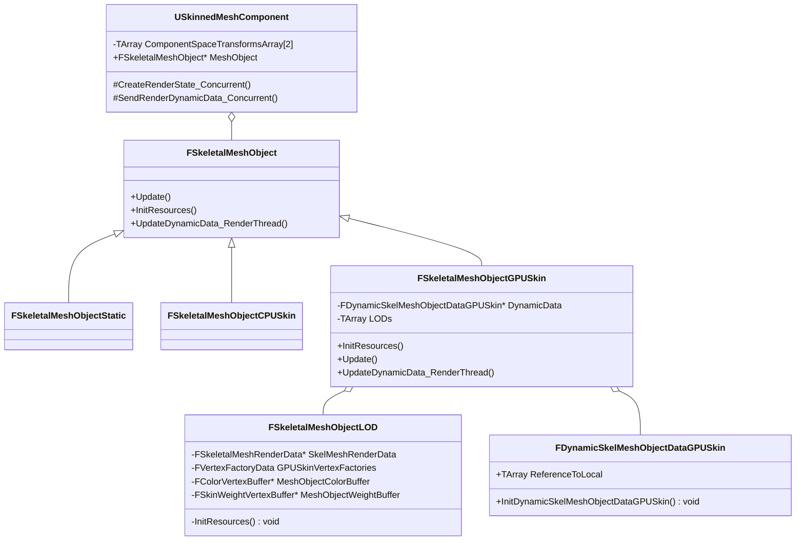

# 解析UE4动画系统

整个动画系统可以分成两个步骤：第一步根据动画确定骨骼的姿势，也就是骨骼在空间中的位置，这一步在本文中称之为动画更新，第二步根据骨骼的位置和顶点的蒙皮信息计算出顶点在世界空间中的位置，这一步在本文中称之为蒙皮。以下是对这两个步骤的具体分析。

## 一 动画更新

### 1 基本数据类型


​																																			类图

##### USkeleton

USkeleton主要记录了骨架的以下信息：

- 骨骼在资源中的Transform、名字、其层级信息
- 参考姿势下，骨骼的Transform、名字、层级信息
- 插槽（Socket）信息
- 虚拟骨骼信息

##### USkeletalMesh

可以应用动画的模型，包含了骨骼和模型以及蒙皮信息

- 模型的顶、线、面信息
- 顶点的骨骼蒙皮权重
- 模型的材质信息
- 模型LOD信息
- 所属骨架
- Morph Target信息
- Physics Asset设置信息
- 布料系统相关设置

##### USkinnedMeshComponent

提供了骨骼蒙皮模型渲染的功能

成员

- ComponentSpaceTransformsArray

  由动画蓝图输出的骨骼姿势Transform信息就存储在这个数组中，提供给蒙皮渲染时使用

- SkeletalMesh

方法

##### USkeletalMeshComponent

包含动画蓝图示例，用来更新骨骼变换信息。

成员

- AnimScriptInstance

  蓝图实例

##### UAnimInstance

动画蓝图类，包含EventGraph和AnimaGraph，驱动节点更新，最后输出一个姿势，为了支持多线程动画更新，其多数功能都在FAnimProxy类中实现。动画蓝图必须与骨骼联系起来。

**方法**

- BlueprintInitializeAnimation

- BlueprintUpdateAnimation

  负责EventGraph的更新，设置变量，更新条件

- UpdateAnimation

- ParallelUpdateAnimation

  AnimaGraph中节点的更新，例如状态机的更新，负责确定该输出哪个姿势

- ParallelEvaluateAnimation

  根据update确定的条件，计算出姿势所包含的骨骼的具体变换信息，以便之后的蒙皮过程使用

##### FAnimInstanceProxy

负责更新AnimaGraph中的节点，确定输出姿势，计算对应姿势所包含的骨骼信息

**方法**

- UpdateAnimationNode_WithRoot

  调用RootNode的更新，驱动RootNode以及其子节点的更新

- EvaluateAnimationNode_WithRoot

  计算姿势包含的骨骼信息

##### FAnimNode_Base

AnimaGraph中的所有节点的基类。

**方法**

- Initialize_AnyThread
- CacheBones_AnyThread
- Update_AnyThread
- Evaluate_AnyThread

##### FAnimNode_Root

表示根节点，例如AnimGraph就是一个根节点，其包含一个FPoseLink对象，指向其子节点

**成员**

- Name
- Result（**FPoseLink**）

##### FPoseLinkBase

节点间连线的抽象，起到两个节点间链接的作用

**成员**

- LinkedNode（FAnimNode_Base*）

##### FPoseLink

继承自FPoseLinkBase，提供了Evaluate函数，表示本地空间中的链接

**方法**

- Evaluate

##### FBakedAnimationState

##### FAnimationTransitionBetweenStates

**FBakedAnimationStateMachine** 

成员

- States：TArray<FBakedAnimationState>

- Transitions：TArray<FAnimationTransitionBetweenStates>

  

##### FAnimNode_StateMachine

动画状态机类

- CurrentState 当前激活节点的索引
- StatePoseLinks 状态机与各个子节点的链接
- PRIVATE_MachineDescription：FBakedAnimationStateMachine* 

方法：

- FindValidTransition


##### FAnimNode_AssetPlayerBase

所有直接输出姿势的节点的父节点，例子BlendSpace，Sequence


### 2 流程

动画更新过程可以细分为

1. 蓝图EventGraph更新
2. 蓝图AnimGraph更新
3. 输出姿势

这三个过程对应的函数分别是AnimaInstance的BlueprintUpdateAnimation，ParallelUpdateAnimation，ParallelEvaluateAnimation

BlueprintUpdateAnimation的实现是UBT自动生成的，主要是为了执行EventGraph中各个流程，输出后续流程需要变量，其代码是定制化的，无法分析也没有分析的必要。所以我们主要对ParallelUpdateAnimation和ParallelEvaluateAnimation做具体分析。

#### 2.1 蓝图AnimGraph更新

##### 更新过程中的数据结构

**FAnimationEvaluationContext**

多线程下，保存动画上下文信息

- 动画蓝图实例AnimInstance
- 骨骼模型实例SkeletalMesh
- 骨骼在ComponentSpace下的Transform
- 骨骼在BoneSpace下的Transform
- bDoInterpolation
- bDoEvaluation

**FAnimationUpdateContext**

动画更新上下文，主要是为了传入信息给AnimNode，用来更新数据

- 帧间隔DeltaTime
- 权重CurrentWeight
- FAnimInstanceProxy

蓝图AnimGraph更新，主要是为了更新动画输出姿势所需的数据，比如时间，比如在StateMachine中找出准确的状态等等。

```c++
USkinnedMeshComponent::TickComponent(float DeltaTime, enum ELevelTick TickType, FActorComponentTickFunction *ThisTickFunction)
{
    USkeletalMeshComponent::TickPose(float DeltaTime, bool bNeedsValidRootMotion)
    {
       	TickAnimation(float DeltaTime, bool bNeedsValidRootMotion)
        {
            UAnimInstance::UpdateAnimation(float DeltaSeconds, bool bNeedsValidRootMotion, EUpdateAnimationFlag UpdateFlag)
            {
                FAnimInstanceProxy::PreUpdate(UAnimInstance* InAnimInstance, float DeltaSeconds)
                {
                    // 初始化FAnimInstanceProxy，初始化URO更新频率
                    InitializeObjects(InAnimInstance);
                }
                // 更新EventGraph
                BlueprintUpdateAnimation();
               	
                // 多线程更新动画时，这一步之前都在主线程更新，在满足多线程动画更新的情况下，下面函数在异步线程中更新
                // 在异步线程中更新时，由USkeletalMeshComponent::PerformAnimationProcessing调用
                ParallelUpdateAnimation();
                {
                    UpdateAnimation_WithRoot(Context, RootNode, NAME_AnimGraph);
                    {
                        // TODO
                    	CacheBones();
                        
                       // RootNode是AnimaGraph
                       UpdateAnimationNode_WithRoot(InContext, InRootNode, InLayerName);
                       {
                           FAnimNode_Root::Update_AnyThread(InContext);
                           {
                               // 根节点
                               FPoseLinkBase::Update(InContext);
                               {
                                   // 这里的LinkNode可能是个StateMachine、BlendSpace或者是个简单的AnimaSequence
                                   // LinkedNode->Update_AnyThread(LinkContext);
                                   // 以StateMachie为例
                                   FAnimNode_StateMachine::Update_AnyThread();
                                   {
                                       // 更新状态机，根据条件找Transition
                                       FindValidTransition();
                                       
                                       FPoseLinkBase::Update(const FAnimationUpdateContext& Context);
                                       {
                                           // 状态机的子节点是FAnimNode_Root
                                           FAnimNode_Root::Update_AnyThread(const FAnimationUpdateContext& Context);
                                           {
                                               FAnimNode_AssetPlayerBase::Update_AnyThread();
                                               {
                                                   // 根据关键帧
                                                   FAnimNode_SequencePlayer::UpdateAssetPlayer();
                                                   {
                                                       // 在Proxy中记录FAnimTickRecord，以备后续Evaluate过程使用
                                                       CreateTickRecordForNode();
                                                   }
                                               }
                                           }
                                       }
                                       
                                       // 记录当前状态更新动画的权重
                                       RecordStateWeight();
                                   }
                               }
                           }
                       }    
                    }
                    // 更新节点信息，例如帧序列播放时间
                    FAnimInstanceProxy::TickAssetPlayerInstances(float DeltaSeconds);
                }
            }
        }
    }
}
```

这一步里对动画的优化有URO，多线程更新。

URO（**Update Rate Optimizations**）

根据骨骼动画离摄像机的远近决定动画更新的频率，比如对于离摄像机比较远的可以每4帧更新一次动画。

##### 重要函数

FindValidTransition()

CreateTickRecordForNode()

RecordStateWeight()

#### 2.2 输出姿势

输出姿势这一步根据记录的TickRecord进行对骨骼姿势的计算，最终输入每根骨骼在这一帧的变换信息，用于之后的蒙皮信息。这一步主要是在ParallelEvaluateAnimation中做的。

##### 更新过程中的数据结构

FPoseContext

- 骨骼的变换信息
- 动画曲线信息

```c++
USkinnedMeshComponent::TickComponent(float DeltaTime, enum ELevelTick TickType, FActorComponentTickFunction *ThisTickFunction)
{
    // 动画AnimGrap更新
    TickPose(float DeltaTime, bool bNeedsValidRootMotion);
    
    // 计算姿势
    RefreshBoneTransforms();
    {
        // Recalculate the RequiredBones array, if necessary
        // AnimCurves.InitFrom(CurrentAnimCurveUIDFinder);
        
        // 设置AnimEvaluationContext，以便在多线程中使用
        
        // 初始化姿势是在主线程做的
        DoParallelEvaluationTasks_OnGameThread();
        // 在多线程中进行姿势的计算
        DispatchParallelEvaluationTasks(TickFunction);
        {
            ParallelAnimationEvaluation();
            {
                PerformAnimationProcessing();
                {
                    // 进行AnimGraph的更新，输出TickRecord,详情参见2.1 蓝图AnimGraph更新
                    UAnimInstance::ParallelUpdateAnimation();
                    
                    EvaluateAnimation();
                    {
                        UAnimInstance::ParallelEvaluateAnimation(bForceRefpose, InSkeletalMesh, EvaluationData);
                        {
                            EvaluateAnimation(FPoseContext& Output);
                            {
                                FAnimInstanceProxy::EvaluateAnimation_WithRoot(FPoseContext& Output, FAnimNode_Base* InRootNode);
                                {
                                    // TODO
                                    CacheBones();
                                    EvaluateAnimationNode_WithRoot(Output, InRootNode);
                                    {
                                        FAnimNode_Root::Evaluate_AnyThread(FPoseContext& Output);
                                        {
                                            FPoseLink::Evaluate(FPoseContext& Output);
                                            {
                                                FAnimNode_StateMachine::Evaluate_AnyThread(FPoseContext& Output);
                                                {
                                                    FPoseLink::Evaluate(FPoseContext& Output);
                                                    {
                                                        FAnimNode_SequencePlayer::Evaluate_AnyThread();
                                                        {
                                                            UAnimSequence::GetAnimationPose();
                                                            {
                                                                DecompressPose();
                                                            }
                                                        }
                                                    }
                                                }
                                            }
                                        }
                                    }
                                }
                            }
                        }
                    }
                    // 以上步骤输出的骨骼姿势是BoneSpace下的Transform
                    EvaluatePostProcessMeshInstance();
                    // Normalize旋转,移动RootBone
                    FinalizePoseEvaluationResult();
                    
                    // 转换BoneSpace下的Transform到ComponentSpace下
                    // ispc优化
                    FillComponentSpaceTransforms();
                }
            }
        }
    }
}

```

最后计算出的骨骼数据记录在了AnimEvaluationContext的ComponentSpaceTransforms中，然后调用USkeletalMeshComponent::CompleteParallelAnimationEvaluation()方法将数据存储在SkinnedMeshComponent的ComponentSpaceTransformsArray中，以便之后的蒙皮过程使用

## 二 蒙皮

### 1 基本数据类型



##### FSkeletalMeshObject

提供了一组接口用来实现模型的渲染

##### FSkeletalMeshObjectGPUSkin

GPUSkinned的数据

### 2 流程

创建蒙皮数据

```c++
USkinnedMeshComponent::CreateRenderState_Concurrent();
{
    // 根据条件创建相应的用来Skinning Mesh的类，默认为GPU Sknnning
    // 当用户选择CPUskinning时，创建FSkeletalMeshObjectCPUSkin
    // 重点分析GPUSkinning
    
    // 渲染数据，蒙皮数据
    new FSkeletalMeshObjectGPUSkin(this, SkelMeshRenderData, SceneFeatureLevel);
    {
        FSkeletalMeshObjectGPUSkin::InitResources(USkinnedMeshComponent* InMeshComponent);
        {
            FSkeletalMeshObjectGPUSkin::FSkeletalMeshObjectLOD::InitResources()
            {
                // 创建 TGPUSkinVertexFactory,创建与蒙皮信息相对应的RHI资源
                FSkeletalMeshObjectGPUSkin::FVertexFactoryData::InitVertexFactories();
        
            }
        }
    }
    
    // 将此Component对应的Proxy添加到渲染队列中，以供渲染
    Super::CreateRenderState_Concurrent(Context);
    
    // 进行一次更新
    FSkeletalMeshObjectGPUSkin::Update()
}
```

更新蒙皮数据

GameThread

 这一步从SkninedComponent中的ComponentSpaceTransformsArray获得骨骼在component下的Transform,将其转换到local空间下，及相对于父骨骼的空间下

```c++
USkinnedMeshComponent::SendRenderDynamicData_Concurrent();
{
    FSkeletalMeshObjectGPUSkin::Update();
    {
        FDynamicSkelMeshObjectDataGPUSkin::InitDynamicSkelMeshObjectDataGPUSkin();
        {
            UpdateRefToLocalMatricesInner();
        }
        
        // 添加SkelMeshObjectUpdateDataCommand到渲染线程队列中
    }
}
```

输出是父骨骼空间下的Transform数组

RenderThread

```c++
FSkeletalMeshObjectGPUSkin::UpdateDynamicData_RenderThread();
{
	FSkeletalMeshObjectGPUSkin::ProcessUpdatedDynamicData();
	{
		FGPUBaseSkinVertexFactory::FShaderDataType::UpdateBoneData();
		{
			// 将上一步主线程下输出骨骼Transform数组lock进GPU缓存
		}
	}
}
```

Vertex Shader中的Skinning

```c
// 根据蒙皮信息计算影响顶点的骨骼矩阵
// 线性蒙皮算法
FBoneMatrix CalcBoneMatrix( FVertexFactoryInput Input )
{
#if GPUSKIN_UNLIMITED_BONE_INFLUENCE
	int NumBoneInfluences = Input.BlendOffsetCount & 0xff;
	int StreamOffset = Input.BlendOffsetCount >> 8;
	int WeightsOffset = StreamOffset + (InputWeightIndexSize * NumBoneInfluences);

	FBoneMatrix BoneMatrix = FBoneMatrix(float4(0,0,0,0), float4(0,0,0,0), float4(0,0,0,0));
	for (int InfluenceIdx = 0; InfluenceIdx < NumBoneInfluences; InfluenceIdx++)
	{
		int BoneIndexOffset = StreamOffset + (InputWeightIndexSize * InfluenceIdx);
		int BoneIndex = InputWeightStream[BoneIndexOffset];
		if (InputWeightIndexSize > 1)
		{
			BoneIndex = InputWeightStream[BoneIndexOffset + 1] << 8 | BoneIndex;
			//@todo-lh: Workaround to fix issue in SPIRVEmitter of DXC; this block must be inside the if branch
			float BoneWeight = float(InputWeightStream[WeightsOffset + InfluenceIdx]) / 255.0f;
			BoneMatrix += BoneWeight * GetBoneMatrix(BoneIndex);
		}
		else
		{
			//@todo-lh: Workaround to fix issue in SPIRVEmitter of DXC; this block must be inside the if branch
			float BoneWeight = float(InputWeightStream[WeightsOffset + InfluenceIdx]) / 255.0f;
			BoneMatrix += BoneWeight * GetBoneMatrix(BoneIndex);
		}
	}
#else // GPUSKIN_UNLIMITED_BONE_INFLUENCE
	FBoneMatrix BoneMatrix = Input.BlendWeights.x * GetBoneMatrix(Input.BlendIndices.x);
	BoneMatrix += Input.BlendWeights.y * GetBoneMatrix(Input.BlendIndices.y);

#if !GPUSKIN_LIMIT_2BONE_INFLUENCES
	BoneMatrix += Input.BlendWeights.z * GetBoneMatrix(Input.BlendIndices.z);
	BoneMatrix += Input.BlendWeights.w * GetBoneMatrix(Input.BlendIndices.w);
	if (NumBoneInfluencesParam > MAX_INFLUENCES_PER_STREAM)
	{
		BoneMatrix += Input.BlendWeightsExtra.x * GetBoneMatrix(Input.BlendIndicesExtra.x);
		BoneMatrix += Input.BlendWeightsExtra.y * GetBoneMatrix(Input.BlendIndicesExtra.y);
		BoneMatrix += Input.BlendWeightsExtra.z * GetBoneMatrix(Input.BlendIndicesExtra.z);
		BoneMatrix += Input.BlendWeightsExtra.w * GetBoneMatrix(Input.BlendIndicesExtra.w);
	}
#endif//GPUSKIN_LIMIT_2BONE_INFLUENCES
#endif // GPUSKIN_UNLIMITED_BONE_INFLUENCE
	return BoneMatrix;
}

FVertexFactoryIntermediates GetVertexFactoryIntermediates(FVertexFactoryInput Input)
{
	FVertexFactoryIntermediates Intermediates;
	
	Intermediates.UnpackedPosition = UnpackedPosition(Input);
#if GPUSKIN_APEX_CLOTH
	SetupClothVertex(Input.ClothVertexID, Intermediates.ClothVertexInfluences);
	if( IsSimulatedVertex(Intermediates.ClothVertexInfluences[0]) )
	{
		Intermediates.PreviousSimulatedPosition = ClothingPosition(Intermediates.ClothVertexInfluences, true);
		Intermediates.SimulatedPosition = ClothingPosition(Intermediates.ClothVertexInfluences, false);
	}
	else
	{
		Intermediates.PreviousSimulatedPosition = Intermediates.SimulatedPosition = Intermediates.UnpackedPosition;
	}
	
#endif

	Intermediates.BlendMatrix = CalcBoneMatrix( Input );

	// Fill TangentToLocal
	Intermediates.TangentToLocal = SkinTangents(Input, Intermediates);

	// Swizzle vertex color.
	Intermediates.Color = Input.Color FCOLOR_COMPONENT_SWIZZLE;

	return Intermediates;
}


void Main(
	FVertexFactoryInput Input,
	out  FBasePassVSToPS  Output
	)
{
	uint EyeIndex = 0;
	ResolvedView = ResolveView();

	FVertexFactoryIntermediates VFIntermediates = GetVertexFactoryIntermediates(Input);
	float4 WorldPositionExcludingWPO = VertexFactoryGetWorldPosition(Input, VFIntermediates);
	float4 WorldPosition = WorldPositionExcludingWPO;
	float4 ClipSpacePosition;
	float3x3 TangentToLocal = VertexFactoryGetTangentToLocal(Input, VFIntermediates);
	FMaterialVertexParameters VertexParameters = GetMaterialVertexParameters(Input, VFIntermediates, WorldPosition.xyz, TangentToLocal);

	{
		WorldPosition.xyz += GetMaterialWorldPositionOffset(VertexParameters);
	}
	{
		float4 RasterizedWorldPosition = VertexFactoryGetRasterizedWorldPosition(Input, VFIntermediates, WorldPosition);
		ClipSpacePosition =  mul(RasterizedWorldPosition, ResolvedView.TranslatedWorldToClip) ;
		Output.Position =  ClipSpacePosition ;
	}
	Output.FactoryInterpolants =  VertexFactoryGetInterpolantsVSToPS (Input, VFIntermediates, VertexParameters);
}

```

在VertexShader中做Skinning的问题是，每个Pass，例如depth pass,bass pass, shadowpass,velocity pass等等都会执行一边计算，当渲染大量的模型时就会有性能瓶颈。
