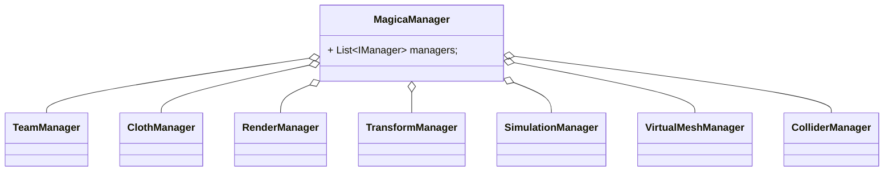
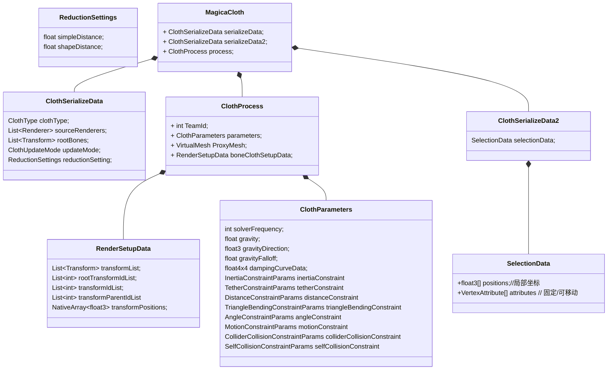
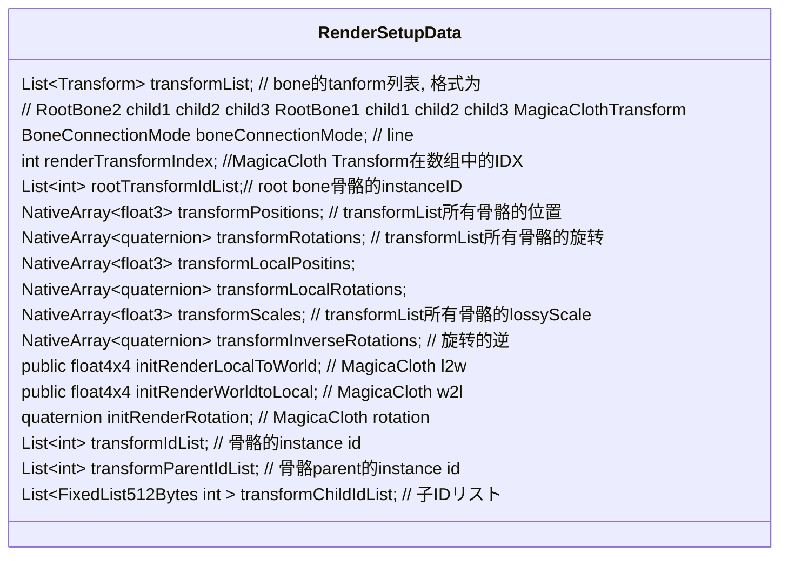
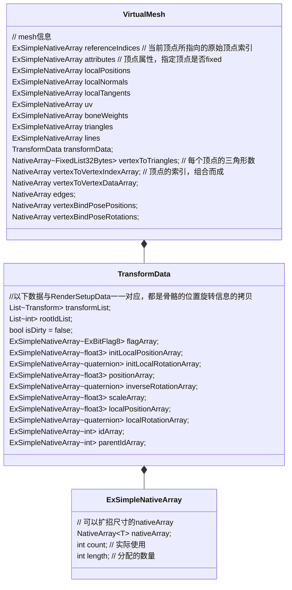
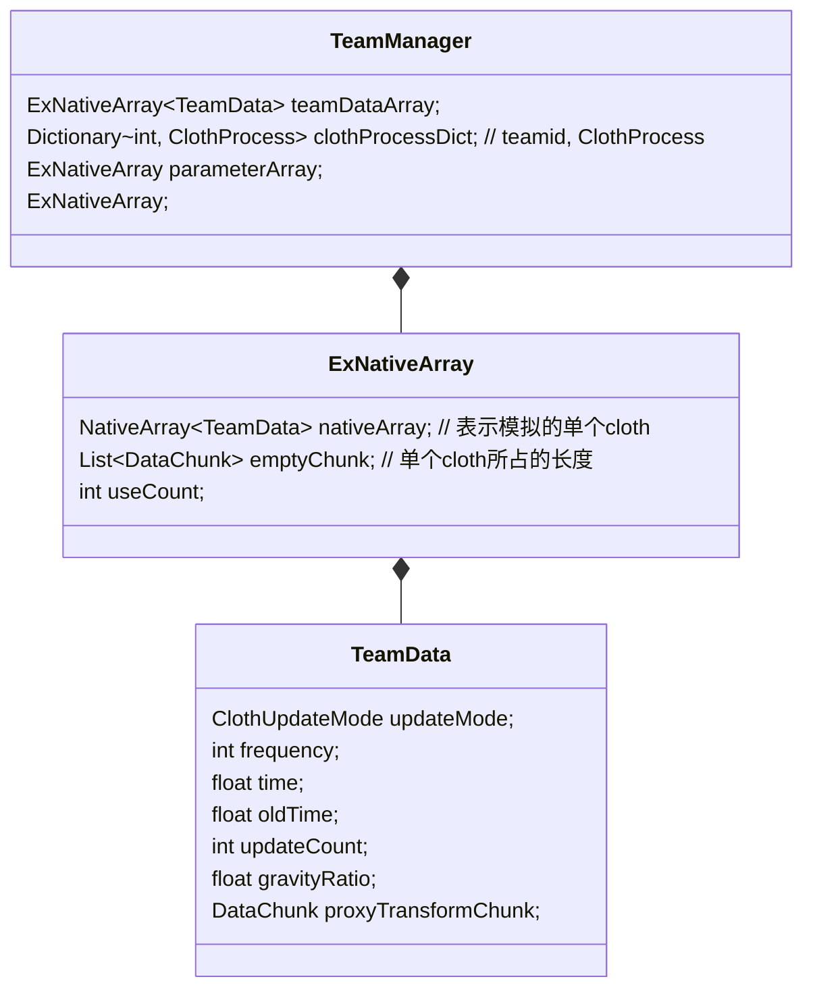
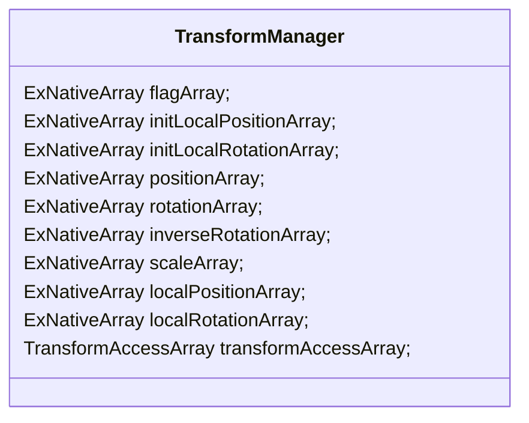
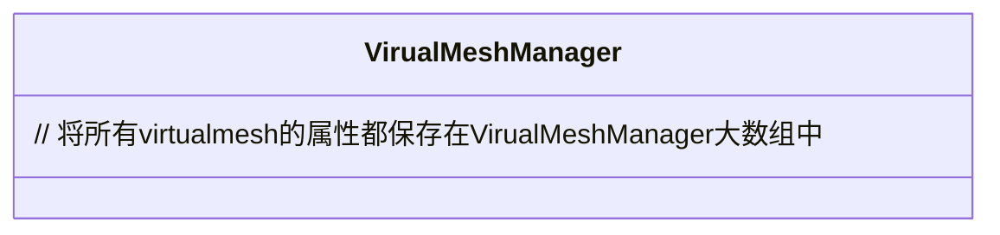
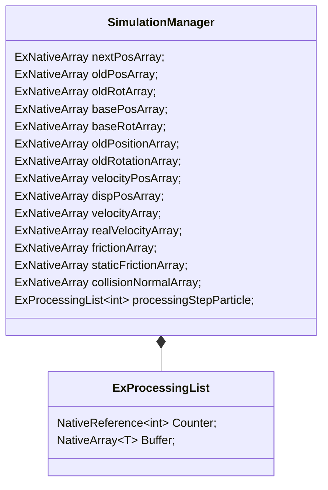

#### 代码分析


















```mermaid

```


#### 重要函数

```c#
VirtualMesh.ImportFrom(RenderSetupData rsetup)
{
    // transformData 从RenderSetupData中拷贝骨骼列表的tranform数据

    void ImportBoneType(RenderSetupData rsetup, int[] transformIndices)
    {
		// 变换信息被转换到本地空间并被分配到顶点信息。
        
        // 两两连线形成mesh 0-1 1-2 2-3
    }
    
    // 计算AABB
    
    // 计算顶点间的最大距离和平均距离
}

// 确定每个顶点是否移动
proxyMesh.ApplySelectionAttribute(selectionData);

public void ConvertProxyMesh(
    ClothSerializeData sdata,
    TransformRecord clothTransformRecord,
    List<TransformRecord> customSkinningBoneRecords,
    TransformRecord normalAdjustmentTransformRecord
) 
{
    // 找到与该顶点相连的顶点列表
    // 创建一个边列表
    // index array: [开始位置，数量]
    // data array:[]相邻顶点的索引
    
    void CreateTransformBaseLine()
    {
        baseLineFlags;// 这条绳子的flag
        baseLineStartDataIndices;// 每条绳子在数组中的起始位置
        baseLineDataCounts;//每条绳子在数组中的数量
        baseLineData;//存储顶点索引的数组
        // [0, 1, 2]
        vertexChildIndexArray; // 子的起始位置和数量 [0,1] [1,1]
        vertexChildDataArray;  // 子的索引[1,2]
    }
    
    // 本地坐标处理
}
```

初始化

```c#
// 创建各种manager并且初始化
// 注册各种更新函数
MagicaManager.Initialize();

MagicaCloth.Awake()
{
    Process.Init();
    {
        AddBoneCloth(sdata.rootBones, sdata.connectionMode);
        {
            boneClothSetupData = new RenderSetupData(clothTransformRecord.transform, rootTransforms, connectionMode, cloth.name);
            {
                // 获取链条层级上的所有骨骼
                // 将骨骼数据保存在NativeArray以便job处理
                // rootTransformIdList
            }
        }
    }
}

MagicaCloth.Awake()
{
    Process.AutoBuild();
    {
        Process.StartBuild();
        {
            BuildAsync();
            {
                //根据bone创建VirtualMesh，连线，计算aabb，uv等等
                
                //fixed属性
                proxyMesh.ApplySelectionAttribute(selectionData);
                
                // 添加到ClothManager中
                MagicaManager.Cloth.AddCloth(this, parameters);
                {
                    // 添加到TeamManager中
                    MagicaManager.Team.AddTeam(cprocess, clothParams);
                }
                
                // 注册到vmesh和simulation manager中
                MagicaManager.VMesh.RegisterProxyMesh(TeamId, ProxyMesh);
                {
                    // 添加bone的Transform到Bone中，也就是TransformManager中
                }
                MagicaManager.Simulation.RegisterProxyMesh(this); 
            }
        }
    }
}

```

#### 数据的流动（传递）

```c++
class MagicaCloth
{
    // root bone
    // 模拟参数
    ClothSerializeData serializeData;
    // 本地坐标、移动属性
    ClothSerializeData2 serializeData2;
    void Awake()
    {
        ClothProcess.Init();
        {
            AddBoneCloth(sdata.rootBones, sdata.connectionMode);
            {
                serializeData -- > RenderSetupData; // bone list transform data
                // 各个骨骼的位置、旋转、缩放、本地位置，本地旋转， 旋转的逆
                // magicacloth的ltw矩阵，wtl矩阵，旋转和缩放
                // bone的InstanceID,parent的Instanceid
            }
        }
    }
   	
	void Start()
    {
        ClothProcess.StartBuild();
        {
            VirtualMesh.ImportFrom(RenderSetupData);
            {
                RenderSetupData --> VirtualMesh.TransformData; 
                // bone list transform data
                RenderSetupData --> VirtualMesh;
                // local pos local up, local forward
                // bindPose 矩阵、boneWeights
                
                // linelist [0, 1] [1, 2][2, 3]
                // 顶点间的最大距离和平均距离 AABB
            }
            
            VirtualMesh.ApplySelectionAttribute(SelectionData);
            {
                serializeData2 --> VirtualMesh; // VertexAttribute
                // Determine vertex attributes by connecting each mesh vertex to the nearest selection data
            }
            
            VirtualMesh.ConvertProxyMesh(sdata, clothTransformRecord, customSkinningBoneRecords, normalAdjustmentTransformRecord);
            {
                NativeArray<int2> edges;
                // 在transformData中的索引
                // [0,1][1,2][2,3][3,4]
                
                vertexToVertexMap;
                // key表示顶点索引，value表示与其相连顶点的索引
                //[key, value]
                //[0,1][1,0][1,2][2,1][2,3][3,2]
                
                NativeArray<uint> vertexToVertexIndexArray;
                // 在vertexToVertexDataArray中的索引
                //[start,count]
            	//{[0,1][1,2][3,2][5,1]}
                
                NativeArray<ushort> vertexToVertexDataArray;
                //[1, 0, 2, 1, 3, 2]
                
                // 
                
                baseLineFlags;// 不相关的骨骼链的flag
                baseLineStartDataIndices;// 每条骨骼链起始索引
                // 例如[0, 8]表示第一条骨骼链从第0个索引开始，到第7个索引结束，第二条骨骼链从第8个索引开始，
                baseLineDataCounts; // 每条骨骼链上的骨骼数
                // 例如[8,4]表示第一条骨骼链有8个骨骼，第二条骨骼链有4个骨骼
                baseLineData;//存储骨骼在数组中的索引
                // [0-7,8-11]
                
                vertexDepths; // 深度数组，根据离root的距离算出来
                vertexRootIndices; // 每个骨骼的root的索引
                //[-1, 0, 0, 0]
            }
            
            MagicaManager.Cloth.AddCloth(this, parameters);
            {
                clothSet.Add(cprocess);
                boneClothSet.Add(cprocess);
                
                MagicaManager.Team.AddTeam(cprocess, clothParams);
                {
                    ClothProcess--> teamDataArray; //每个cloth的teamdata
                    clothParams--> parameterArray//
                    // [cloth1_team_data, cloth2_team_data, cloth3_team_data]
                }
            }
                
            MagicaManager.VMesh.RegisterProxyMesh(TeamId, ProxyMesh);
            {
                MagicaManager.Bone.AddTransform(proxyMesh.transformData);
                {
                    VirtualMesh.TransformData --> TransformManager;   
                    //[c1_transform_s, c1_transform_e, c2_transform_s, c2_transform_e, c3_transform_s, c3_transform_e]
                    //DataChunk[c1_start_idx, c1_count]
                }

                VirtualMesh.attributes --> VirtualMeshManager.attributes;  
                // vertexBindPosePositions, vertexLocalPositions, positions, vertexToTriangles, edges, baseLineChunk
            }
                
            MagicaManager.Simulation.RegisterProxyMesh(ClothProcess);
            {
                // 保留cloth需要的数据块大小
                // teamIdArray
                // [1,1,1,1,2,2,2]表示前四个顶点属于第一个team，后三个顶点属于第二个team
            }
                
            MagicaManager.Collider.Register(ClothProcess);
            {
                // 保留cloth需要的数据块大小
            }
        	
            // 创建约束数据
            distanceConstraintData = DistanceConstraint.CreateData(ProxyMesh, parameters);
            {
                // map
                // [0,1][1,0][1,2]
                
                //verticalConnection
                //horizontalConnection
                //[0,1][1,0][1,2]
                
                // map的set
                connectSet;
                
                indexList;
                /*
                在datalist中的索引
                [0,1][1,2][3,2]
                */
                dataList;
                /*
                [1, 0, 2, 1, 2]
                */
                
                distanceList;
                /*
                [dis01,dis10,dist12]
                */
            }
            
            bendingConstraintData = TriangleBendingConstraint.CreateData(ProxyMesh, parameters);
            inertiaConstraintData = InertiaConstraint.CreateData(ProxyMesh, parameters);
        	// 注册约束数据
            MagicaManager.Simulation.RegisterConstraint(this);
        }
    }
}
```

#### 模拟流程

```c#
AfterEarlyUpdate()//之后
{
    TransformRestoreUpdate();
    {
        MagicaManager.Bone.RestoreTransform(masterJob);//将所有骨骼的位置旋转都置为初始状态
    }
}
AfterFixUpdate()
{
    TeamManager.AfterFixUpdate()
    {
    	fixedUpdateCount++;
    }
}

AfterUpdate(); // do nothing

AfterLateUpdate()
{
    void ClothManager.StartClothUpdate()
    {
        // 更新每个cloth的例如更新频率，时间，重力等等参数信息
        TeamManager.AlwaysTeamUpdate();
        {
            
        }
        
        SimulationManager.WorkBufferUpdate();
        
        // 从transform中读取位置旋转信息保存到NativeArray中以便以后进行物理模拟
        // transform --> TransformManager
        TransformManager.ReadTransform(jobHandle);
        {
            
        }
		
        // 对代理网格进行蒙皮处理以获得基本姿态。
        VirtualMeshManager.PreProxyMeshUpdate(jobHandle);
        {
            // 从TransformManager中读取骨骼数据蒙皮网格顶点
            CalcTransformOnlySkinningJob();
        }
        
        TeamManager.CalcCenterAndInertia();
        {
            // 根据每个顶点在上一帧的移动距离计算出质心的移动距离和旋转度 
            for (int i = 0; i < fcnt; i++)
            {       
                cen += positions[vindex];
                cnt++;
                centerWorldPos = cen / cnt;
                centerWorldRot = MathUtility.ToRotation(math.normalize(nor), math.normalize(tan));
            }

            cdata.frameWorldPosition = centerWorldPos;
            cdata.frameWorldRotation = centerWorldRot;
        }
        
        // 如果teamdata reset了就重置数据
        SimulationManager.PreSimulationUpdate();
        {
            
        }

        for (int i = 0; i < maxUpdateCount; i++)
        {
            // pbd 实现
            masterJob = SimulationManager.SimulationStepUpdate(maxUpdateCount, i, masterJob);
            {
                TeamManager.SimulationStepTeamUpdate(i);
                {
                    // 如果i>team的updateCount,不进行update
                    
                    // 更新时间
                    tdata.nowUpdateTime += tdata.SimulationDeltaTime;
                    tdata.frameInterpolation = (tdata.nowUpdateTime - tdata.frameOldTime) / (tdata.time - tdata.frameOldTime);
                    
                    // 质心位置更新，旋转更新
                    cdata.nowWorldPosition = math.lerp(cdata.oldFrameWorldPosition, cdata.frameWorldPosition, tdata.frameInterpolation);
                	cdata.nowWorldRotation = math.slerp(cdata.oldFrameWorldRotation, cdata.frameWorldRotation, tdata.frameInterpolation);

                    cdata.stepVector = cdata.nowWorldPosition - cdata.oldWorldPosition;
                    cdata.stepRotation = MathUtility.FromToRotation(cdata.oldWorldRotation, cdata.nowWorldRotation);
                    
                    cdata.angularVelocity = stepAngle / tdata.SimulationDeltaTime;
                    
                    moveInertiaRatio = math.lerp(moveInertiaRatio, 1.0f, 1.0f - param.inertiaConstraint.movementInertia);
                    cdata.inertiaVector = math.lerp(float3.zero, cdata.stepVector, moveInertiaRatio);
                    cdata.inertiaRotation = math.slerp(quaternion.identity, cdata.stepRotation, rotationInertiaRatio);
                    
                    // 重力更新
                }
                
                // 并不是所有team都会在每个子步中更新，所以要算出每个子步中更新的team的粒子数
                ClearStepCounter();
                CreateUpdateParticleList();
                {
                    processingStepParticle;
                    // Counter, 本次模拟共有多少个粒子
                    // buffer, 每个粒子在位置列表中的索引
                    
                    processingStepBaseLine;
                    // Counter 骨骼链的数量
                    // buffer 每条骨骼链的索引
                    
                    processingStepTriangleBending;
                    processingStepEdgeCollision;
                    processingStepMotionParticle;
                    processingSelfParticle;
                    processingSelfPointTriangle;
                    processingSelfEdgeEdge;
                    processingSelfTrianglePoint;                        
                }
                
                // Create a list of colliders that need to be calculated in this step.
                MagicaManager.Collider.CreateUpdateColliderList(updateIndex, jobHandle);
                //Collider Update
                MagicaManager.Collider.StartSimulationStep(jobHandle);
                
                // Velocity update, effect of external forces, inertial shift
                StartSimulationStepJob();
                {
                    // 更新每个顶点的basepos
                    float3 basePos = math.lerp(oldPosition, position, tdata.frameInterpolation);
                    quaternion baseRot = math.slerp(oldRotation, rotation, tdata.frameInterpolation);
                    basePosArray[pindex] = basePos;
                	baseRotArray[pindex] = baseRot;
                    stepBasicPositionArray[pindex] = basePos;
                	stepBasicRotationArray[pindex] = baseRot;
                    
                    var velocity = velocityArray[pindex];
                    
                    float3 inertiaVector = cdata.inertiaVector;
                    quaternion inertiaRotation = cdata.inertiaRotation;
                    float inertiaDepth = param.inertiaConstraint.depthInertia * (1.0f - depth * depth); // 二次曲線
                    inertiaVector = math.lerp(inertiaVector, cdata.stepVector, inertiaDepth);
                    inertiaRotation = math.slerp(inertiaRotation, cdata.stepRotation, inertiaDepth);   
                    
                    float3 lpos = oldPos - cdata.oldWorldPosition;
                    lpos = math.mul(inertiaRotation, lpos);
                    lpos += inertiaVector;
                    float3 wpos = cdata.oldWorldPosition + lpos;
                    var inertiaOffset = wpos - nextPos;

                    // nextPos
                    nextPos = wpos;
                    
                    // 速度位置も調整
                    velocityPos += inertiaOffset;

                    // 速度に慣性回転を加える
                    velocity = math.mul(inertiaRotation, velocity);   
                    
                    velocity *= 1.0f - damping;
                    
                    // pbd算法中对速度和位置的更新
                    // 算法 第5-7行
				  float3 force = 0;
                    float3 gforce = param.gravityDirection * (param.gravity * tdata.gravityRatio);
                    force += gforce;
                    force *= tdata.scaleRatio;
                    velocity += force * tdata.SimulationDeltaTime;
                    nextPos += velocity * tdata.SimulationDeltaTime;
                    
                    velocityPosArray[pindex] = velocityPos;

                    // 予測位置格納
                    nextPosArray[pindex] = nextPos;
                }
                
                // 求解约束
                // pbd算法第9-10行
                jobHandle = tetherConstraint.SolverConstraint(jobHandle);
                jobHandle = distanceConstraint.SolverConstraint(jobHandle);
                jobHandle = angleConstraint.SolverConstraint(jobHandle);
                jobHandle = bendingConstraint.SolverConstraint(jobHandle);
                jobHandle = colliderCollisionConstraint.SolverConstraint(jobHandle);
                jobHandle = distanceConstraint.SolverConstraint(jobHandle);
                jobHandle = motionConstraint.SolverConstraint(jobHandle);
                jobHandle = selfCollisionConstraint.SolverConstraint(updateIndex, jobHandle); 
                
                EndSimulationStepJob();
                {
                    // 静摩擦力对速度的影响
                    
                    float3 velocity = (nextPos - velocityOldPos) / tdata.SimulationDeltaTime;
                    float sqVel = math.lengthsq(velocity);
                    float3 normalVelocity = sqVel > Define.System.Epsilon ? math.normalize(velocity) : 0;
                    
                    // 动摩擦力对速度的影响
                    
                    
                    // 离心力对速度的影响
                    
                    velocityArray[pindex] = velocity;
                    
                    float3 realVelocity = (nextPos - oldPos) / tdata.SimulationDeltaTime;
                	realVelocityArray[pindex] = realVelocity;
                    oldPosArray[pindex] = nextPos;
                } 
            }
        }
        
        SimulationManager.CalcDisplayPosition();
        {
            var pos = positions[vindex];
            var rot = rotations[vindex];
            
            var dpos = oldPosArray[pindex];
            float3 velocity = realVelocityArray[pindex] * tdata.SimulationDeltaTime;
            float3 fpos = dpos + velocity;
            float interval = (tdata.nowUpdateTime + tdata.SimulationDeltaTime) - tdata.oldTime;
            float t = interval > 0.0f ? (tdata.time - tdata.oldTime) / interval : 0.0f;
            fpos = math.lerp(dispPosArray[pindex], fpos, t);
            dpos = fpos;
            
            dispPosArray[pindex] = dpos;
            positions[vindex] = dpos;
            
            oldPositionArray[pindex] = pos;
            oldRotationArray[pindex] = rot;
        }
        
        VirtualMeshManager.PostProxyMeshUpdate();
        {
            WriteTransformDataJob();
            {
                // 从vmeshmanager中写回到transformmanager中
            }
        }
          
        // 写回到transform中
        bm.WriteTransform(masterJob);
    }
}

AfterDelayedUpdate()
{
    RenderManager.PreRenderingUpdate()
    {
        foreach (var rdata in renderDataDict.Values)
            rdata?.WriteMesh(); 
    }
}

AfterRendering()
{
    TeamManager.AfterRenderring()
    {
        fixedUpdateCount = 0;
    }
}
```

#### 论文

#### 并行化

​	Parallelization of the PBD approach is an important topic since multi-core systems and massively parallel GPUs are ubiquitous today. In a single CPU implementation, the solver processes the constraints one by one in a Gauss-Seidel-type fashion. Thereby, after each constraint projection, the positions of affected particles are immediately updated. In a parallel implementation, the constraints are processed in parallel by multiple threads. If two constraints affecting the same particle are handled by two different threads simultaneously, they are not allowed to immediately update the particle’s position because writing to the same position simultaneously leads to race conditions making the process unpredictable. A solution to circumvent this problem is to use atomic operations. Such operations are guaranteed not to be interrupted. However, atomics can slow down parallel execution significantly. To avoid these issues, a parallel implementation of PBD needs to split the constraints into groups or phases. In each phase, none of the constraints are allowed to share a common particle. With this restriction, the constraints in the first phase can be processed in parallel without conflicts. Then, after a global synchronization, the next phase can be processed. This cycle is repeated until all constraints are processed.

As an example, if N particles are connected in a serial chain, the constraints 1−2,3−4,5−6,7−8,.. can be processed in phase 1 and the constraints 2−3,4−5,6−7,.. in phase 2. This specific example corresponds to the Red-Black Gauss Seidel scheme, where there are two sets (colors) of constraints. For more general types of constraint such as the stretch, shear and bending constraints of cloth, more phases are needed. In this general case, splitting constraints into phases corresponds to the graph coloring problem, where each constraint corresponds to a node of the graph and two constraints are connected by an edge if they affect one or more common particles. The minimum number of colors determines how many phases are needed in the parallel execution of PBD. Keeping the number of phases small is not the only optimization criterion. The sets also need to have similar sizes for good load balancing.

​	PBD方法的并行化是一个重要的课题，因为多核系统和大规模并行GPU在今天无处不在。在单个CPU实现中，求解器以高斯-赛德尔式的方式逐一处理约束条件。因此，在每个约束条件投影之后，受影响粒子的位置会立即更新。在并行实现中，约束条件是由多个线程并行处理的。如果影响同一粒子的两个约束条件被两个不同的线程同时处理，它们不允许立即更新粒子的位置，因为同时写到同一位置会导致竞赛条件，使过程不可预测。规避这个问题的一个解决方案是使用原子操作。这样的操作可以保证不被打断。然而，原子操作会大大降低并行执行的速度。为了避免这些问题，PBD的并行实现需要将约束条件分成若干组或阶段。在每个阶段中，不允许任何约束条件共享一个共同的粒子。有了这个限制，第一阶段的约束可以在没有冲突的情况下被并行处理。然后，在全局同步后，可以处理下一个阶段。这个循环重复进行，直到所有的约束都被处理。

举例来说，如果N个粒子以串行链连接，那么1-2,3-4,5-6,7-8...的约束可以在第一阶段处理，2-3,4-5,6-7...的约束在第二阶段处理。这个具体的例子对应于红-黑高斯-塞德尔方案，其中有两组（颜色）的约束。对于更普遍的约束类型，如布的拉伸、剪切和弯曲约束，需要更多的阶段。在这种一般情况下，将约束条件分成几个阶段对应于图的着色问题，每个约束条件对应于图的一个节点，如果两个约束条件影响一个或多个共同的粒子，则用一条边连接。色彩的最小数量决定了在PBD的并行执行中需要多少个阶段。保持较少的阶段数并不是唯一的优化标准。为了实现良好的负载平衡，各组也需要有类似的大小。

#### Strain Limiting

Strain limiting is an important topic in the field of cloth simulation. The reason is that the low solver iteration counts used in real-time applications yield stretchy cloth. Since most cloth types are perceived by the human eye as completely inextensible, it is important to make simulated cloth inextensible in order to avoid disturbing visual artifacts

A strain limiting method makes sure that the overall stretch of the cloth stays below a certain threshold. In force based simulations, strain limiting is a separate pass which is executed before or after the regular cloth solver. In most cases, this pass moves the positions of vertices directly, even in force based simulations. Therefore, most strain limiting methods fall under the category of position-based methods

A straightforward way of limiting strain is to iterate through all edges of a cloth mesh and project the adjacent particles of overstretched edges as shown in Figure 1 so that the stretch of the edge does not exceed the stretch limit. Provot [Pro95] was among the first to use this method in the context of cloth simulation. He performs a single iteration through all cloth edges after a force based solver. Desbrun et al. [DSB99] and Bridson et al. [BMF03] later used the same post solver strain limiter but with multiple iterations through all edges. Due to its simplicity, this method is still one of the most popular strain limiting methods used in cloth simulations .

The method is very similar to position-based cloth simulation. The main difference is that the strain limiting pass described above does not influence the velocities. These are updated by the force-based solver. In contrast, position-based cloth simulation derives the new velocities from the projections, making an additional solver pass obsolete. Therefore, every position-based strain limiting method used in force based simulations can directly be used in a PBD solver.

The result of projecting along edges depends on the structure of the mesh. To reduce this artifact, Wang et al. [WOR10] propose to limit the principal strains of the 2D deformation field within each triangle. The 2D deformation field can be determined by considering the 2D coordinates of the vertices of a triangle within the planes of the rest and current triangle configurations. Wang et al. compute the principal strains of the 2D deformation gradient, clamp them and construct a new 2D transformation using the clamped strains. With this new transformation they correct the current positions of the triangle vertices. As before, to limit strain globally, they iterate through all triangles multiple times in a Gauss-Seidel fashion.

Due to the relatively slow convergence rate of a GaussSeidel solver, high iteration counts are necessary to limit the strain globally which slows down the simulation. The two main methods to improve the convergence rate are the use of a global Newton-Raphson solver as proposed by Goldenthal et al. [GHF∗ 07] or to perform Gauss-Seidel iterations on a hierarchy of meshes as proposed in [Mül08], [WOR10] and [SKBK13]. However, these methods complicate the implementation and even though their convergence rate is higher, a single iteration can be significantly more expensive than a simple Gauss-Seidel iteration.

Recently, Kim et al. [KCM12] found a surprisingly simple and robust technique they call Long Range Attachments (LRA) to prevent cloth from getting stretched globally with low iteration counts. Their method exploits the fact that stretching artifacts almost always appear when cloth is attached. In this case, instead of only applying attachment constraints to the subset of the vertices near the region where the cloth is attached and relying on error propagation of the solver for all other vertices, they apply unilateral attachment constraints to all the vertices by attaching each vertex to one or more attachment point directly. The rest lengths of these long range attachments can either be set to the Euclidean distance in the rest state or via measuring geodesic lengths along the cloth. Figure 7 demonstrates the method on a single rope attached at one end. The method allows the simulation of a piece of cloth with 90K vertices at interactive rates as shown in Figure 8.

A similar approach was recently proposed by Müller et al. [MKC12] to guarantee zero stretch in a single pass for the case of attached ropes. This approach allows the simulation of thousands of hair strands in real time (Figure 10). Figure 9 visualizes the basic idea. Particle x1 is attached. To satisfy the first distance constraint, particle x2 is moved towards x1 such that their mutual distance is l0. Particle x3 is then moved towards the new position of x2 and similarly along the chain until the last particle is reached. After this single pass, all the distance constraints are satisfied. This method is called Follow The Leader (FTL). While LRA guarantees zero stretch of all the particles w.r.t. the attachment points, the constraint between consecutive particles can still remain overstretched. On the other hand, in contrast to LRA which is momentum conserving, FTL introduces unphysical behavior. Not projecting distance constraints symmetrically means that a system is simulated for which each particle has infinitely more mass than its successor. To compensate for this behavior, the authors replace the PBD velocity update 

where di+1 is the position correction applied to particle i+1 and sdamping ∈ [0,1] a scaling factor do influence damping. While this modification of DFTL (dynamic FTL) hides the un-physical behavior of FTL, it introduces a certain amount of damping which is acceptable for the simulation of hair and fur as the author’s results show.


The Long Range Attachments (LRA) method used to simulate an inextensible rope attached at one end. Each particle is constrained or remain inside a sphere centered at the attachment point (red) whose radius is the initial distance from the particle to the attachment. For each configuration, target positions are shown in green when particles need to be projected. Particles inside the constraint spheres are allowed to move freely.


​														

拉力限制是布料模拟领域的一个重要课题。原因是实时应用中使用的低求解器迭代次数产生了拉伸的布。由于大多数布的类型被人眼认为是完全不可拉伸的，因此使仿真布不可拉伸是很重要的，以避免干扰视觉伪影。

拉力限制方法可以确保布的整体伸展性保持在某个阈值以下。在基于力的模拟中，拉力限制是一个单独的过程，在常规布的求解器之前或之后执行。在大多数情况下，这个过程会直接移动顶点的位置，即使是在基于力的模拟中。因此，大多数拉力限制方法都属于基于位置的方法范畴。

一个直接的限制拉力的方法是遍历布料的所有边缘，并将过度拉伸的边缘的相邻粒子投影出来，如图1所示，使边缘的拉伸不超过拉伸极限。Provot[Pro95]是最早在布料模拟中使用这种方法的人之一。他在基于力的求解器之后对所有布料的边缘进行了一次迭代。Desbrun等人[DSB99]和Bridson等人[BMF03]后来也使用了相同的解算后拉力限制器，但在所有的边上进行了多次迭代。由于其简单性，这种方法仍然是布料模拟中最流行的拉力限制方法之一。

该方法与基于位置的布料模拟非常相似。主要的区别是，上述的拉力限制通道不影响速度。这些是由基于力的求解器更新的。相反，基于位置的布料模拟从投影中得到新的速度，使得额外的求解器通道变得过时。因此，基于力的模拟中使用的每一种基于位置的拉力限制方法都可以直接用于PBD求解器。

沿着边缘投影的结果取决于网格的结构。为了减少这种假象，Wang等人[WOR10]提出对每个三角形内的二维变形场的主拉力进行限制。二维变形场可以通过考虑三角形顶点在其余和当前三角形配置的平面内的二维坐标来确定。Wang等人计算了二维变形梯度的主拉力，对其进行了钳制，并利用钳制的拉力构建了一个新的二维变换。通过这个新的变换，他们修正了三角形顶点的当前位置。和以前一样，为了限制全局拉力，他们以高斯-赛德尔的方式多次迭代所有三角形。

由于高斯-塞德尔求解器的收敛速度相对较慢，高的迭代次数是必要的，以限制全局的拉力，从而减慢模拟速度。提高收敛率的两个主要方法是使用Goldenthal等人提出的全局Newton-Raphson求解器[GHF∗07]，或者像[Mül08]、[WOR10]和[SKBK13]中提出的那样在网格的层次结构上进行Gauss-Seidel迭代。然而，这些方法使实施变得复杂，即使它们的收敛率较高，单次迭代也会比简单的高斯-赛德尔迭代昂贵得多。

最近，Kim等人[KCM12]发现了一种令人惊讶的简单而稳健的技术，他们称之为长距离附件（LRA），以防止布在低迭代次数下被全局拉伸。他们的方法利用了这样一个事实：当布料被附着时，拉伸伪影几乎总是出现。在这种情况下，他们不是只对连接布的区域附近的顶点子集应用连接约束，而是对所有其他顶点依赖解算器的错误传播，他们通过将每个顶点直接连接到一个或多个连接点，对所有顶点应用单边连接约束。这些长距离附着点的静止长度可以设置为静止状态下的欧几里得距离，也可以通过测量沿布的测地线长度。图7展示了该方法在一端连接的单绳上的应用。如图8所示，该方法允许以交互速率模拟一块具有90K顶点的布。

Müller等人[MKC12]最近提出了一个类似的方法，以保证在连接绳索的情况下单次拉伸为零。这种方法可以实时模拟数千条头发丝（图10）。图9直观地展示了基本思路。粒子x1被附着。为了满足第一个距离约束，粒子x2被移向x1，使它们的相互距离为l0。然后，粒子x3被移向x2的新位置，类似地沿链移动，直到到达最后一个粒子。经过这一次的移动，所有的距离约束都得到了满足。这种方法被称为跟随领导者（FTL）。虽然LRA保证了所有粒子在连接点上的零拉伸，但连续的粒子之间的约束仍然可以保持过度拉伸。另一方面，与保持动量的LRA相比，FTL引入了非物理的行为。不对称地投射距离约束意味着模拟了一个系统，其中每个粒子的质量都比其后续粒子的质量大得多。为了补偿这种行为，作者将PBD的速度更新改为

其中di+1是应用于粒子i+1的位置修正，sdamping∈[0,1]是一个比例系数做影响阻尼。虽然这种对DFTL（动态FTL）的修改隐藏了FTL的非物理行为，但它引入了一定量的阻尼，正如作者的结果所显示的那样，对于模拟头发和毛皮来说，这是可以接受的。

------

## 

