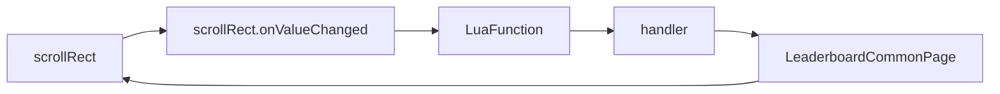

# C#对象泄露问题

## 前置知识

1. #### Unity对象机制

   

   ```mermaid
   classDiagram
   class NamedObject
   class Object{
   	NamedObject* obj
   }
   
   Object *-- NamedObject
   ```

   **原生对象(Native Object)**，**包装对象(wrapper object)**

   

2. #### Tolua 导出c#对象到lua的机制

   

   ```mermaid
   classDiagram
   class LuaState{
   	ObjectTranslator translator
   }
   
   class ObjectTranslator{
   	Dictionary~object, int~ objectsBackMap
   	LuaObjectPool objects
   }
   
   class LuaObjectPool{
   	List~PoolNode~ list
   }
   
   class PoolNode{
       int index
       object obj
   }
   
   LuaState *-- ObjectTranslator
   ObjectTranslator *-- LuaObjectPool
   LuaObjectPool *-- PoolNode
   ```

   在C#层维护一个Cache来引用那些被Lua访问过的C#层对象，防止出现以下的问题：当Lua中再次访问该C#对象时，该对象可能已经被C#层的GC回收掉了，从而导致逻辑错误。

3. #### 正常ToLua对象销毁流程

   

   

   ```mermaid
   graph TD
   NativeObject销毁  --> 调用LuaGC释放lua对象 --> Tolua清理Cache中被GC的c#层对象 --> 调用MonoGC释放C#层对象
   
   ```

## 泄露

#### 如何检测泄露


```c#
    var node = list[collectedIndex];
    object o = node.obj;
    if (o != null && o.Equals(null))
    {
        node.obj = null;
        if (collectListener != null)
        {
            collectListener(o, collectedIndex);
        }
    }
```


#### 泄露的几种写法

1. ####  Timer

   ```lua
   --event.lua
   UpdateBeat = event("Update", true)
   
   -- Timer.lua
   function Timer.New(func)
       self.func = func
   end
   
   function Timer.Start()
       if not self.handle then 
           self.handle = UpdateBeat:CreateListener(self.Update, self)
       end
       
       UpdateBeat:AddListener(self.handle)
   end
   
   function Timer.Stop()
       if self.handle then 
           UpdateBeat:RemoveListener(self.handle)
       end
   end
   
   --用法
   
   function XXXWindow:initTimer()
       self.timer_ = Timer.New(handler(self, self.onTimerUdated))
   end
   
   function XXXWindow:onTimerUdated()
   end
   
   function XXXWindow:dispose()
       self.timer_:Stop()
       XXXWindow.super.dispose()
   end
   
   ---
   UpdateBeat:Add(self.onHandleUpdate, self)
   ```

   ```mermaid
   graph LR
   UpdateBeat-->Timer-->Timer.func-->XXXWindow
   ```

2. #### EventProxy

   ```lua
   --- EventProxy.lua
   
   function EventProxy:addEventListener(eventName, listener, data)
       local handle = self.eventDispatcher_:addEventListener(eventName, listener, data)
     	...
       return handle, self
   end
   
   --- 用法
   
   function XXXView.cotr()
       self.eventProxy_ = xyd.EventProxy.new(xyd.EventDispatcher.inner(), self)
   end
   
   function XXXView:registerEvent()
       self.eventProxy_:addEventListener("PlayerInut", handler(self, self.onInput))
   end
   
   function XXXView:onInput()
   end
   
   function XXXView:dispose()
       self.eventProxy_:removeAllListener()
   end
   ```

   ```mermaid
    graph LR
   EventDispatcher-->handler-->xxxView
   ```

3. 代理函数

```lua
function LeaderboardCommonPage:initUIComponent()
    ...
	UGUIEventUtils.ScrollRectOnValueChanged(self.scrollRectContainer_, handler(self, self.onContentPosUpdated))
end
```

```c#
public static void ScrollRectOnValueChanged(ScrollRect scrollRect, UnityAction<Vector2> callback)
{
    scrollRect.onValueChanged.AddListener(callback);
}
```



```c#
public void StepCollect(Action<object, int> collectListener)
{
    ++collectedIndex;
    for (int i = 0; i < collectStep; ++i)
    {
        collectedIndex += i;
        if (collectedIndex >= count)
        {
            collectedIndex = -1;
            return;
        }

        var node = list[collectedIndex];
        object o = node.obj;
        if (o != null && o.Equals(null))
        {
            node.obj = null;
            if (collectListener != null)
            {
                collectListener(o, collectedIndex);
            }
        }
    }
}
```


## 工具介绍

https://github.com/yaukeywang/LuaMemorySnapshotDump

```lua
collectgarbage("collect")
local window = xyd.slt.windowMgr.windowRef["leaderboard_window"]
local mri = require(MemoryReferenceInfo)
mri.m_cMethods.DumpMemorySnapshotSingleObject("./", "SingleObjRef-Object", -1, "leaderboard_window", window)
```


https://github.com/leinlin/Miku-LuaProfiler


```lua
function handler(obj, method)
    if method and obj then
        return function(...)
            return method(obj, ...)
        end
    end
end
```


## 优化结果


参考：

1. https://github.com/topameng/tolua

2. https://github.com/leinlin/Miku-LuaProfiler

3. https://github.com/yaukeywang/LuaMemorySnapshotDump

4. https://www.cnblogs.com/yaukey/p/unity_lua_memory_leak_trace.html

5. https://blog.uwa4d.com/archives/UWALab_LuaProfiler.html

6. https://www.zhihu.com/question/307064711

7. https://blog.csdn.net/weixin_45776473/category_12209933.html 

   