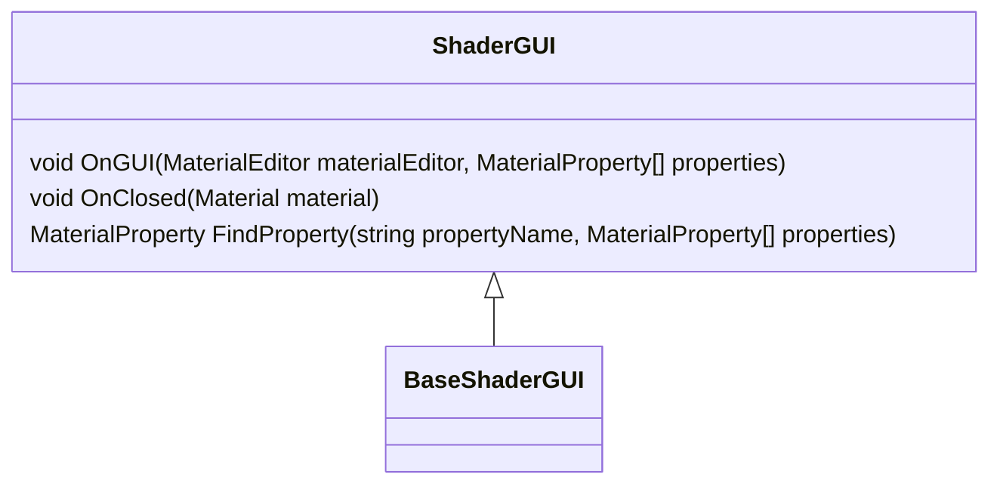

# ShaderGUI

```mermaid
classDiagram
class ShaderGUI{
	void OnGUI(MaterialEditor materialEditor, MaterialProperty[] properties)
	void OnClosed(Material material)
	MaterialProperty FindProperty(string propertyName, MaterialProperty[] properties)
}

ShaderGUI <|-- BaseShaderGUI
class BaseShaderGUI{
	
}
```

