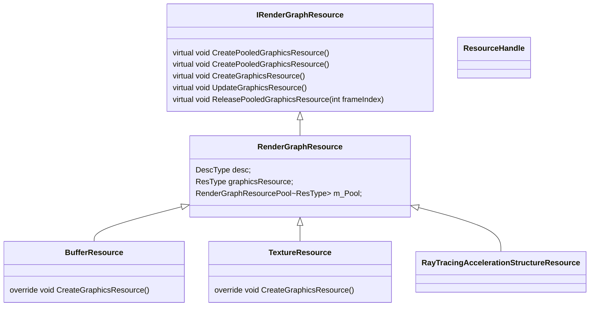
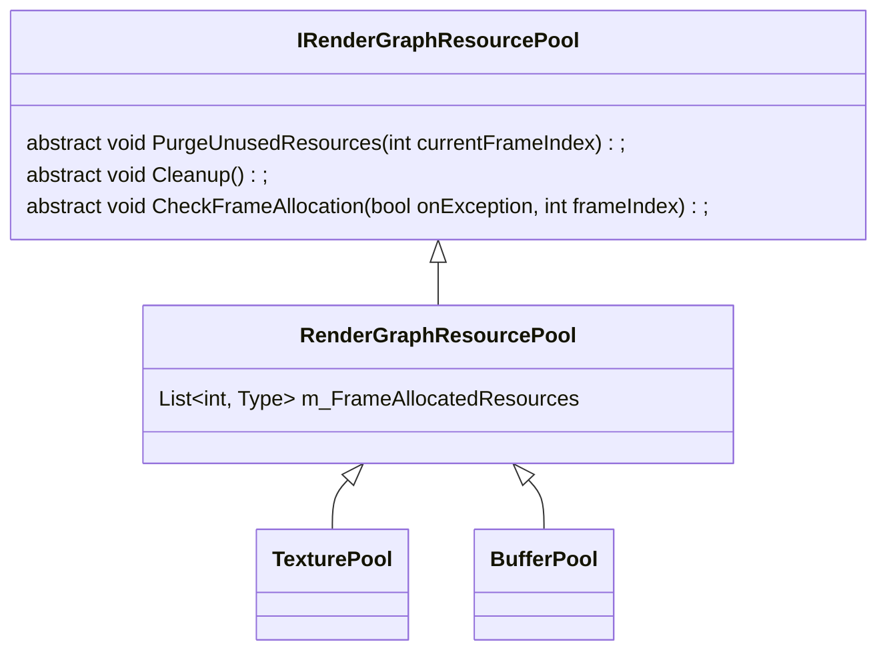
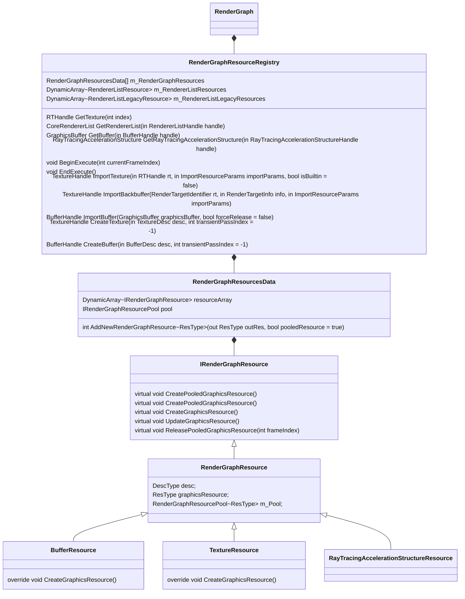
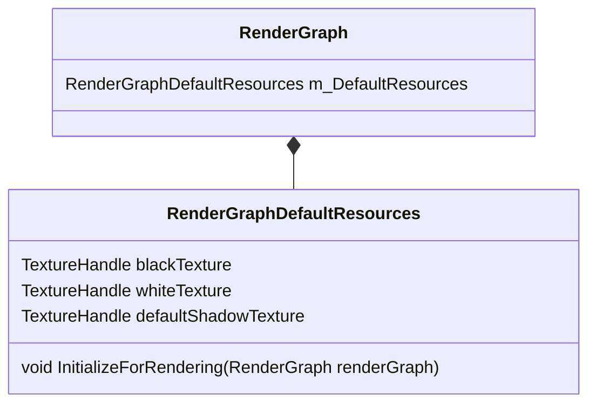
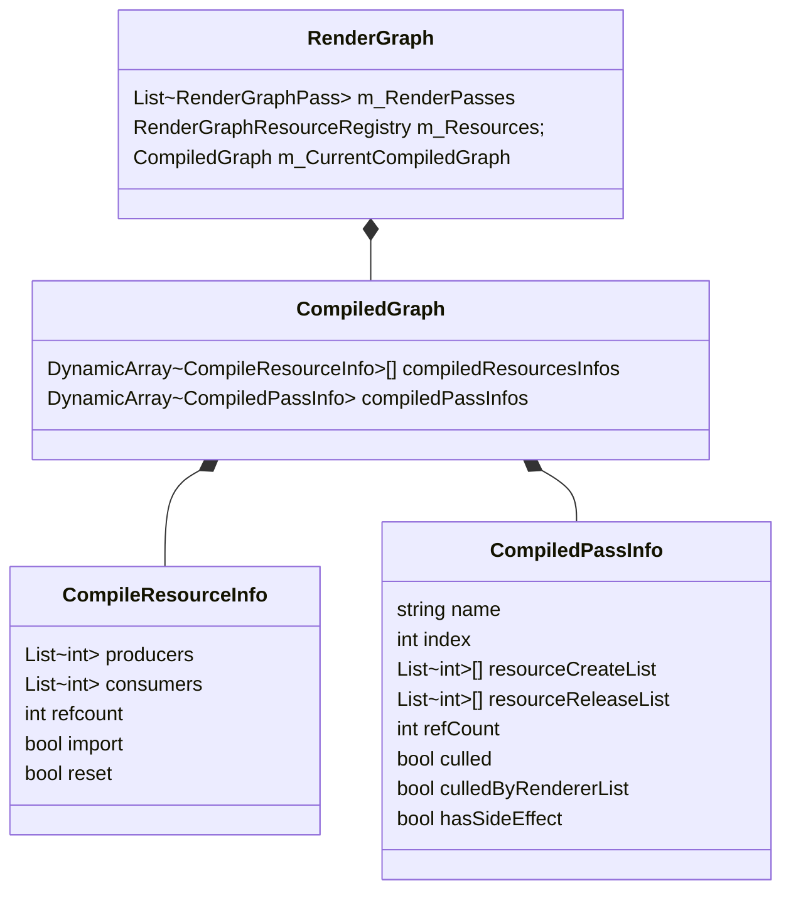
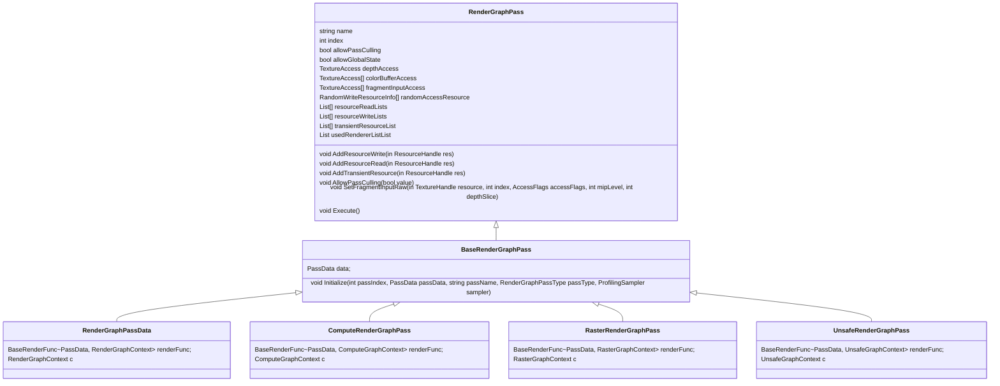
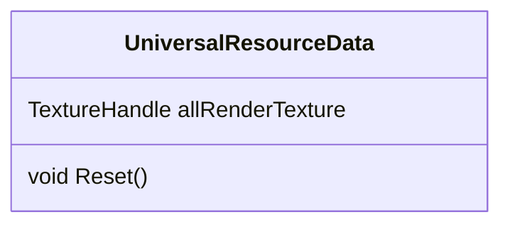

# URP中的Render Graph

## Resource












------

### 编译相关

### Pass相关




# 流程

```c#
static void RenderSingleCamera(ScriptableRenderContext context, UniversalCameraData cameraData)
```

1. Renderer.Clear()

   对Attachment和Target做清理工作

2. RTHandles.SetReferenceSize

3. Cull

   - 回调PreCull函数
   - Cull

4. 创建渲染相关的的数据

   - UniversalLightData
   - UniversalShadowData
   - UniversalPostProcessingData
   - UniversalCameraData
   - UniversalRenderingData

5. CreateShadowAtlasAndCullShadowCasters

6. 添加RenderFeature中的RenderPasses

7. RecordAndExecuteRenderGraph

## RecordAndExecuteRenderGraph

1. BeginRecording

2. RecordRenderGraph

   

------

# URP流程

## 第一阶段 准备渲染数据




## 第二阶段 记录RenderGraph

```c#
UniversalRenderPipeline.RecordAndExecuteRenderGraph(RenderGraph renderGraph, ScriptableRenderContext context, ScriptableRenderer renderer, CommandBuffer cmd, Camera camera, string cameraName)
{
    renderGraph.BeginRecording(RenderGraphParameters)
    {
        // renderGraph记录各种渲染过程中用的变量
        // cmd、scriptableRenderContext、
        // 初始化DefaultResources
        // 分配或者释放Shared Resources
    }
    
    ScriptableRenderer.RecordRenderGraph(RenderGraph renderGraph, ScriptableRenderContext context)
    {
        OnBeginRenderGraphFrame(); // 初始化UniversalResourceData，使其资源变得可读
        InitRenderGraphFrame();
        {
            // 设置全局关键字(Shadow)
            // 设置shader中的时间变量
        }
        
        UniversalRenderer.OnRecordRenderGraph(renderGraph, context);
        {
            UniversalRenderer.SetupRenderGraphLights(renderGraph, renderingData, cameraData, lightData);
            {
              // 设置Light，初始化，设置shader变量,keyword   
            }
            
           UniversalRenderer.CreateRenderGraphCameraRenderTargets(renderGraph, isCameraTargetOffscreenDepth);
            {
                // 只分配了cameraColor和cameraDepth
                // 其他只创建了Handle
            }
            
            // 记录BeforeRendering的RenderFeature
            RecordCustomRenderGraphPasses(renderGraph, RenderPassEvent.BeforeRendering);
            
            SetupRenderGraphCameraProperties(); // 设置Camera相关的shader变量，比如matrix
            
            OnBeforeRendering(renderGraph);
            {
                m_ForwardLights.PreSetup(renderingData, cameraData, lightData); // forward + 设置
                
                // 记录在阴影渲染前的pass
                RecordCustomRenderGraphPasses(renderGraph, RenderPassEvent.BeforeRenderingShadows);
                
                // 分配阴影贴图
                m_MainLightShadowCasterPass.Setup(renderingData, cameraData, lightData, shadowData);
                // 记录主光源的阴影
                m_MainLightShadowCasterPass.Render(renderGraph, frameData); 
                
                // 记录在阴影渲染后的pass
                RecordCustomRenderGraphPasses(renderGraph, RenderPassEvent.AfterRenderingShadows);
                
                OnMainRendering(renderGraph, context);
                {
                    // 记录ClearTargetsPass
                    
                    //
                }
            }
        }
    }
}
```


## 第三阶段 编译RenderGraph

## 第四阶段 执行RenderGraph
