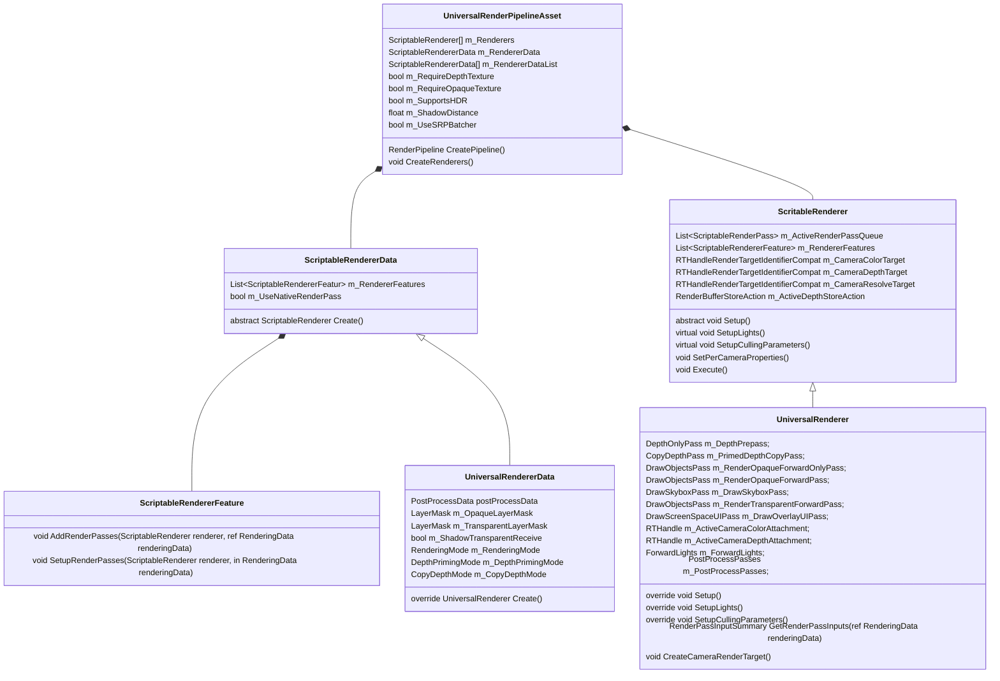
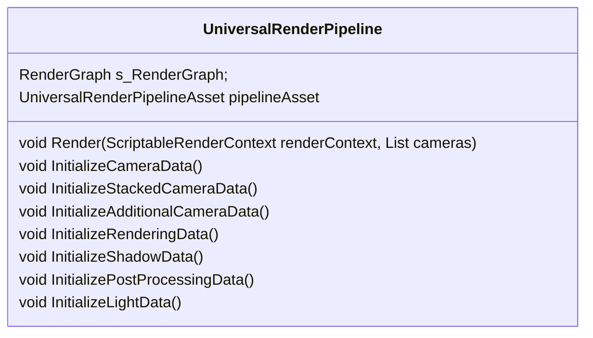
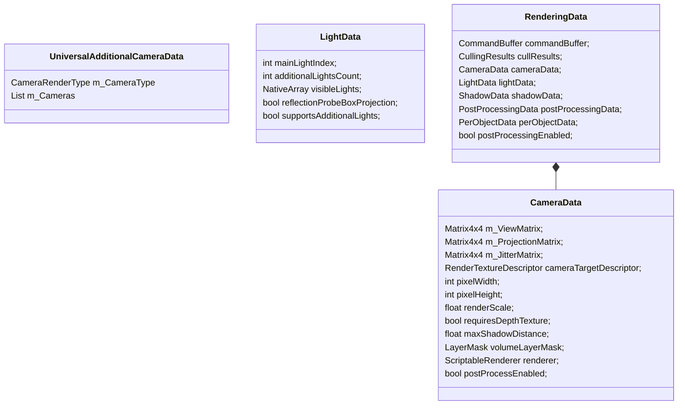

# URP管线阅读记录

## 类图







## 重要函数

```c#
UniversalRenderer.Setup(ScriptableRenderContext context, ref RenderingData renderingData)
```

1. 当camera的targetTexture格式是Depth时，渲染一张离线的深度图（不透明+半透明Pass）

2. 遍历所有的RenderFeature, 获取渲染过程需要用到的RT（Depth, Normal, Color, Motion, DepthPrePass）

3. 遍历所有的RenderFeature处理RenderLayer

4. 对depthTexture的处理

   需要DepthTexture的三种情况

   - camera或者管线设置了DepthTexture
   - Render Feature中需要用到DepthTexture
   - 强制开启了DepthPrimingMode（PreZ）
   - 后处理中需要用到DepthTexture

   需要PreZ Pass的几种情况

   - 后续渲染步骤中要用到DepthTexture，但GPU不支持拷贝pass
   - 强制开启pre z pass
   - Render Feature中需要用到PreZPass或者需要用的NormalTexture
   - 开启了DepthPriming

   设置CopyDepth Pass的执行时机

   - RenderData中的设置
   - 如果Render Feature中设置了更小的值，则使用Render Feature中的
   - 如果只是后处理需要这个值，那么直接在AfterRenderingTransparents之后进行Copy Depth Pass

   创建DepthTexture的情况

   - 需要DepthTexture但不需要PrePass（PrePass会自己创建DepthTexture）
   - 使用DepthPriming时

   创建DepthTexture

   - m_CameraDepthAttachment
   - 名字是_CameraDepthAttachment

5. 对ColorTexture的处理

   
